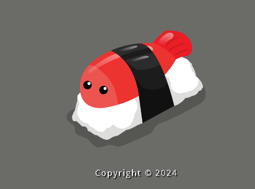

# 🍣 Sushiki Sushi - Site Restaurante

  

Este é o repositório de um site fictício para o restaurante Sushiki Sushi, desenvolvido como um projeto pessoal para praticar HTML e CSS.

## 📝 Visão Geral do Projeto

O site é composto por três páginas principais:
- **Página Inicial (`index.html`):** Apresentação do restaurante.
- **Cardápio (`cardapio.html`):** Menu com os pratos disponíveis.
- **Reservas (`reservar.html`):** Página para realizar reservas.

## ✨ Link para o Site (GitHub Pages)

Você pode acessar a versão online do site aqui:
**[https://guh13.github.io/SushikiSushi/]**

## 🛠️ Tecnologias Utilizadas
- HTML5
- CSS3
- JavaScript

## 📸 Screenshot

